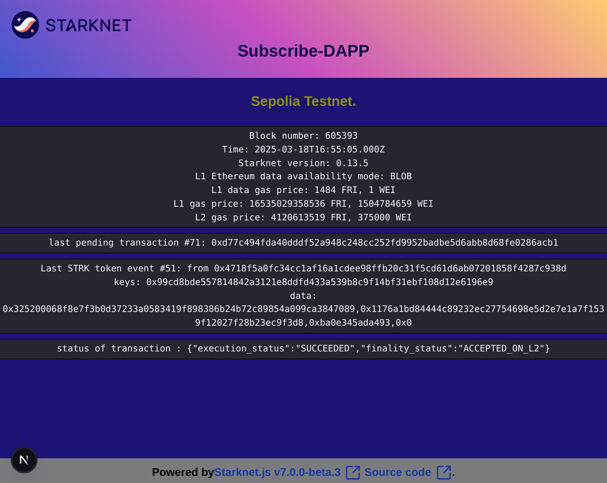

# Starknet-subscribe-DAPP

A small DAPP demonstrating the Starknet websocket subscriptions.

<p align="center">
  
</p>

You can subscribe to Websocket messages sent by your Starknet WebSocket v0.9 node.
You can ask to your node to send automatically a message each time:
- a new block is created.
- a transaction has changed its status.
- a contract has generated a new event.
- a new transaction has been added in the PRE-CONFIRMED block.

## Launch
The test DAPP is deployed [here](https://starknet-subscribe.vercel.app/).

## Local execution
- Add at the root a `.env.local` file, including `NEXT_PUBLIC_WS_PROVIDER=`, and add the url of your rpc0.9 websocket server.
 
> [!TIP]
>  Examples for local nodes:
> ```bash
> NEXT_PUBLIC_WS_PROVIDER=ws://localhost:9545/rpc/v0_9 # pathfinder 
> # NEXT_PUBLIC_WS_PROVIDER=ws://localhost:6071/ws/rpc/v0_9 # juno
> ```

- Launch with `npm run dev`
- In your browser, open `http://localhost:3000/`
